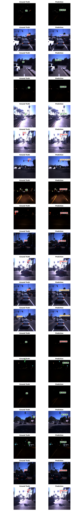

# Changelog

# Week 1

- Initial data preparation
- EDA
- Visualization of data

# Week 2

- Rethought the assignment
- Starting to classify traffic lights type

# Last week

- Training models
- It takes 5+ hours to train a model
- Results are pretty good
